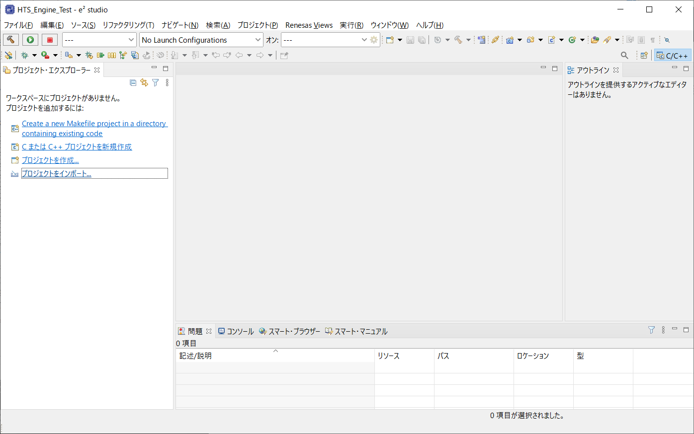

# OpenJTalk for GR-MANGO

OSSの音声合成ソフト[OpenJTalk](http://open-jtalk.sp.nitech.ac.jp/)のエンジン[hts_engine API](http://hts-engine.sourceforge.net/)を[GR-MANGO](https://www.renesas.com/jp/ja/products/gadget-renesas/boards/gr-mango)で動かしたサンプルプログラム。
（その後、OpenJTalkも組込みました。）

[Mbed](https://os.mbed.com/platforms/Renesas-GR-MANGO/)ライブラリと[Mbed Library for GR-Boards mbed-gr-libs](https://github.com/renesas-rz/mbed-gr-libs)を使用し、[SSIF loop back sample](https://github.com/renesas-rz/RZ_A2M_Mbed_samples/blob/master/sample_programs/sample_02_ssif_loop_back.cpp)を改造して作りました。

## ！注意！

RZ/A2Mに関する[テクニカルアップデート](https://www.renesas.com/jp/ja/document/tcu/note-size-octaram-memory-octa-memory-controller-rza2m-group-products?language=ja&r=1054511)によりOctaRAMは8MByteまでしか使えないらしいです！

手元のGR-MANGOでは16MByte使えているように見えますので不思議です。手元のは2017年製のようです。

[ここ](bin/app_hts.bin)にバイナリファイルを置いたので、8MByteしか使えないGR-MANGOか試してからお使いください。

e2studioの「メモリ」でも確認できます。

## ビルド方法

ビルドには[e² studio](https://www.renesas.com/jp/ja/software-tool/e-studio)を使用します。

- e2 studioを起動

  

- 「プロジェクトをインポート…」をクリック

  

- 「プロジェクトをワークスペースへ」を選択して「次へ」

  

- ダウンロードしたzipフィルを選択して「終了」

  

- ビルド

  左領域の「app_hts」を選択して、上部のトンカチボタンでビルドします。

- プロジェクト参照

  ビルドはMbedが含まれるため時間がかかるが、ライブラリとなっているので、アプリ部分「app_hts」の変更であれば、すぐに終わるはず。

  ライブラリのソースを変えていないのに再ビルドが行われる場合は、プロジェクト参照を変更してください。

  

  手順は「app_hts」の右クリックメニューで「プロパティ」を選択、右領域の「プロジェクト参照」を選択して、再ビルドが行われるプロジェクトのチェックを外してください。

- プロジェクト構成について

  Mbedは以下のプロジェクトに分割してあります。「mbed_os」「mbed_os_cpp」「mbed_os_lwipstack」「mbed_os_mbedtls」「mbed_os_nanostack」「mbed_os_nfc」。

  これは、1つのプロジェクトにするとオブジェクトファイルが多すぎて、リンクコマンドが失敗してしまうためです。

  各プロジェクトに*.cや*.cppを割り振っていますが、*.hはすべて「mbed_os」に置いてあります。ちょっと雑なファイル構成です。

## 実行方法

マイクロSDカードに音響モデル(htsvoiceファイル)を入れる必要があります。

|SDカードのファイル|提供元|
|-|-|
|nitech_jp_atr503_m001.htsvoice|OpenJTalk|
|mei\\mei_happy.htsvoice|MMDAgent|
|mei\\mei_normal.htsvoice|MMDAgent|
|mei\\mei_sad.htsvoice|MMDAgent|
|dic\\*|OpenJTalk|

htsvoiceファイルは下記のサイトからダウンロードしてください。

- OpenJTalk

  [OpenJTalk](https://sourceforge.net/projects/open-jtalk/files/)から、次のようにフォルダ辿って「HTS voice」→「hts_voice_nitech_jp_atr503_m001-1.05」、「[hts_voice_nitech_jp_atr503_m001-1.05.tar.gz](https://sourceforge.net/projects/open-jtalk/files/HTS%20voice/hts_voice_nitech_jp_atr503_m001-1.05/hts_voice_nitech_jp_atr503_m001-1.05.tar.gz/download)」をダウンロードします。
  「nitech_jp_atr503_m001.htsvoice」をSDカードのルートフォルダに入れます。

  OpenJTalkを使う場合は、「Dictionary」→「open_jtalk_dic-1.11」と辿って、「[open_jtalk_dic_utf_8-1.11.tar.gz](https://sourceforge.net/projects/open-jtalk/files/Dictionary/open_jtalk_dic-1.11/open_jtalk_dic_utf_8-1.11.tar.gz/download)」をダウンロードします。
  「open_jtalk_dic_utf_8-1.11」フォルダの中身をSDカードの「dir」フォルダに入れます。

- MMDAgent

  [MMDAgent](http://www.mmdagent.jp/)から、「MMDAgent "Sample Script"」にある「[Source code](https://sourceforge.net/projects/mmdagent/files/MMDAgent_Example/MMDAgent_Example-1.8/MMDAgent_Example-1.8.zip/download)」をクリックしてダウンロードします。
  「Voice\\mei」フォルダをSDカードの「mei」フォルダに入れます。

### 参考サイト

- [Raspberry piで日本語音声合成(Open JTalk)を試してみる。](https://qiita.com/lutecia16v/items/8d220885082e40ace252)

- [Windowsで音声合成Open JTalk](https://qiita.com/mkgask/items/0bf9c26dc96e7b0b45ac)

## デバッグ方法

Renesasさんの[MbedのWiki](https://os.mbed.com/teams/Renesas/wiki/How-to-debug-with-e2-studio)に書いてある手順で、GR-MANGOだけでデバッグができます。

「app_hts.launch」を用意したので参考サイトの手順「New Configuration」を行わず「app_hts」を選択でも可能です。

## 変更点

[Qiita](https://qiita.com/h7ga40/items/daa71423a2ce9d6c54ea)にも、変更内容の一部を詳しく書きました。

### HTS Engineの省メモリ化

- 「double」型を「float」型に変更。
- シンセサイザの各ステップで、参照しなくなった前ステップのメモリを解放。
- シンセサイザの最終ステップ「`HTS_gstream.c`」で、合成したPCMデータを全てをメモリに置かず、部分的なバッファのサイズに変更。
- malloc/freeでOctaRAMを使用するよう「`HTS_calloc`」「`HTS_free`」の実装を変更。

### MBedのGR-MANGOポーティング部

- 標準のブートローダーはOctaRAMが8MBになっているため、「`mbed_sf_boot.c`」で16MBになるよう変更。
- スタックが足らなかったため「`mbed_config.h`」の「`MBED_CONF_RTOS_MAIN_THREAD_STACK_SIZE`」を「`16384`」に変更。

### SSIF loop back sample

- HTS Engineの呼び出しを追加。
- マイクからの入力では無く、HTS Engineからの合成結果で音声出力するよう変更。

### OpenJTalkのmmap処理変更

- `mmap`は使えないので、ファイルを全てメモリに読み込むようになっているが、`sys.dic`ファイルはサイズが100MByte近くあるので、値が必要な場合は随時ファイルから読み出すように変更。

## ライセンス

ライセンスはそれぞのをファイルにある記載を確認してください。

変更部分があるので、注意してください。

変更内容については、自由に使ってください。
